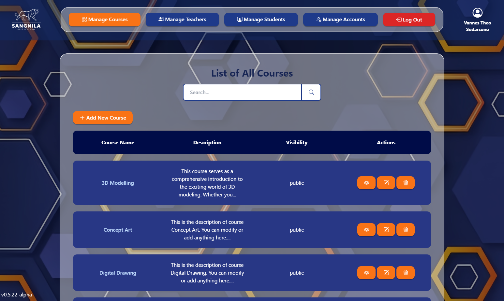

# Sangnila LMS
## About
A web based learning management system application designed for admins, teachers, and students in Sangnila Arts Academy. The web application is still in development and is not ready to use yet. This web application is using Tailwind CSS and JQuery to manage its front end side and Laravel and MySQL to handle its backend side.



## Roles
There are 5 roles (types of account) in Sangnila LMS:
- **Admins**: Those who are in charge in observing and managing the whole LMS system including `courses`, `teachers`, `students`, and `accounts`
- **Teachers**: Those who are assigned to manage `topic and materials` also teaching and managing students' `progress`, `attendance`, and `assignment` in Sangnila courses
- **Students**: Those who are enrolled and is currently in learning progress in Sangnila courses, they are able to access learning `materials`, `attendance` data, and upload `assignments`
- **Parents**: Students' parents, those who are observing students' progress and learning results
- **Guests**: Public user, those who are don't have any account to use, can only view few parts of Sangnila LMS

## Change Logs
### v0.6.1-alpha
- Implemented UI designs for teachers pages (undone)

### v0.6.2-alpha
- Implemented UI designs for teachers pages (done)
- Notification for admins (how many students is reaching their maximum sessions)
- Improvements on admins' and teachers' UIs especially when data empty
- Some transition and animations detailing for navbars and pages bottom components (footer and back to top button)

### v0.6.3-alpha
- Implemented UI designs for students pages (done)
- Implemented UI designs for guests pages (undone)
- Some fixes on navigation bars responsiveness

### v0.6.4-alpha
- Added last material progress and learning status to attendance upload, edit, and show
- Improvement on import student page
- Normalization of imported student

## Clone Project
Clone the repository in any desired directory. Web resources such as images, videos, scripts, and styles are included in `public` folder. To generate the database system and fill it will sample data, run this command in the terminal:
```bash
php artisan migrate
```
```bash
php artisan db:seed
```
Then to run the web application, first make sure that MySQL is activated and the database is already set. Next you can either type this in the browser URL if you have installed XAMPP and already set symbol link from the `project folder` to `htdocs` folder:
```bash
localhost/project-folder/public/
```
or by run this command in the terminal:
```bash
php artisan serve
```
